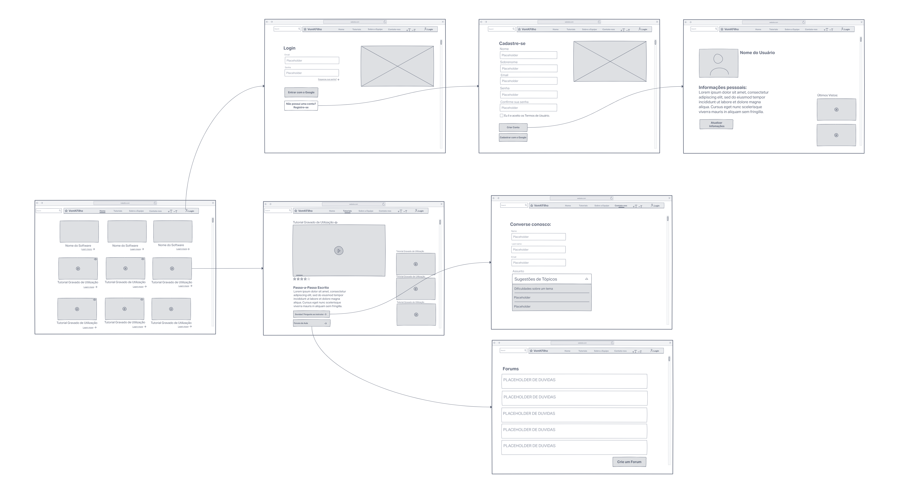
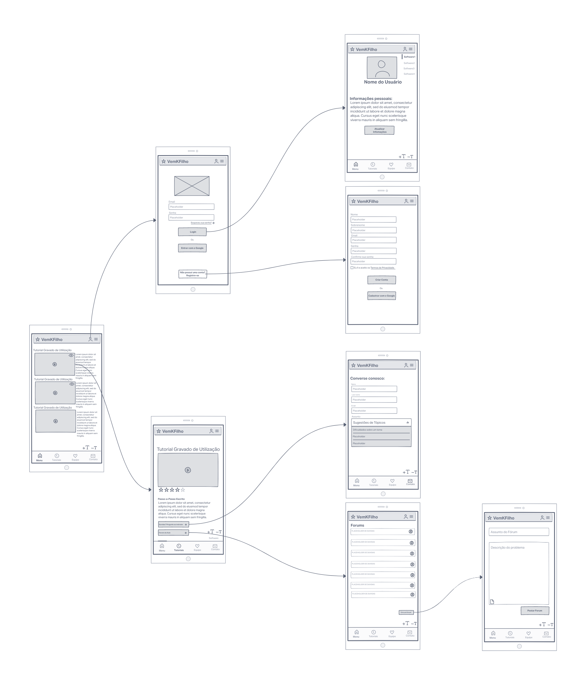
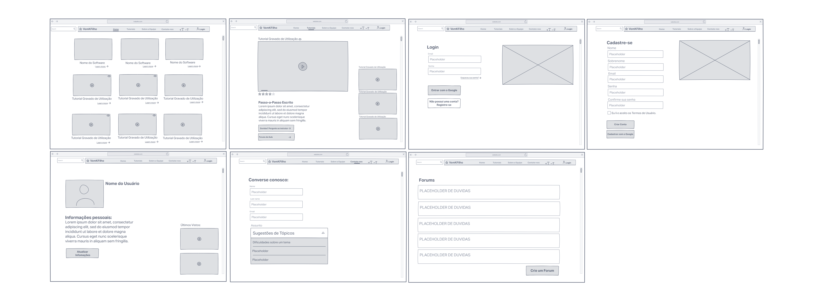
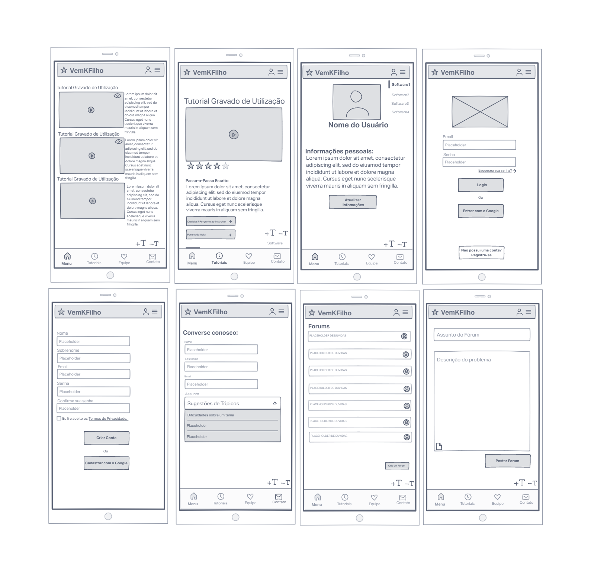

# Informações do Projeto
`TÍTULO DO PROJETO`  

**VemKFilho**

`CURSO` 

**Ciência da Computação**

## Participantes

André Luiz Baptista Esteves Bassini

André Mateus Fonseca Neves

Antônio Victor Oliveira Gonçalves

Diego Ruas Toledo

Henrique de Almeida Diniz

# Estrutura do Documento

- [Informações do Projeto](#informações-do-projeto)
  - [Participantes](#participantes)
- [Estrutura do Documento](#estrutura-do-documento)
- [Introdução](#introdução)
  - [Problema](#problema)
  - [Objetivos](#objetivos)
  - [Justificativa](#justificativa)
  - [Público-Alvo](#público-alvo)
- [Especificações do Projeto](#especificações-do-projeto)
  - [Personas e Mapas de Empatia](#personas-e-mapas-de-empatia)
  - [Histórias de Usuários](#histórias-de-usuários)
  - [Requisitos](#requisitos)
    - [Requisitos Funcionais](#requisitos-funcionais)
    - [Requisitos não Funcionais](#requisitos-não-funcionais)
  - [Restrições](#restrições)
- [Projeto de Interface](#projeto-de-interface)
  - [User Flow](#user-flow)
  - [Wireframes](#wireframes)
- [Metodologia](#metodologia)
  - [Divisão de Papéis](#divisão-de-papéis)
  - [Ferramentas](#ferramentas)
  - [Controle de Versão](#controle-de-versão)
- [**############## SPRINT 1 ACABA AQUI #############**](#-sprint-1-acaba-aqui-)
- [Projeto da Solução](#projeto-da-solução)
  - [Tecnologias Utilizadas](#tecnologias-utilizadas)
  - [Arquitetura da solução](#arquitetura-da-solução)
- [Avaliação da Aplicação](#avaliação-da-aplicação)
  - [Plano de Testes](#plano-de-testes)
  - [Ferramentas de Testes (Opcional)](#ferramentas-de-testes-opcional)
  - [Registros de Testes](#registros-de-testes)
- [Referências](#referências)

# Introdução

## Problema

  Identificamos que a grande maioria de idosos possuem dificuldades ou resistências, ao usar tecnologias que não são habituados. Porque esse grupo de usuarios sofre com isso? E qual seria a maneira funcional onde podemos instruir o idoso para que o medo e a dificuldade se extinguem rapidamente?

## Objetivos

  Com a constante evolução da tecnologia, nosso grupo identificou que muitos idosos possuem dificuldade em usar as novas ferramentas que foram desenvolvidas - seja por comodismo, ou por limitações físicas, ou até mesmo pela obstinação em não aprender. Portanto, nós pretendemos criar um site que facilite a interação entre os idodos e as novas funções existentes e que ao mesmo tempo seja atraente e intuitivo para esse público-alvo.

## Justificativa
  O avanço tecnológico possibilita o desenvolvimento da potencialidade humana em várias dimensões. No entanto, a mesma tecnologia que propicia liberdade, autonomia, integração, também pode excluir. Deixando aquele que não esta presente junto ao crescimento da tecnologia faz ter a vulnerabilidade tecnologica. 
  A dificuldade em tecnologia está presente em toda faixa etaria da atualidade, mas o idoso por não estar incluido na necessidade desse crescimento tecnologico, tem a constante necessidade de auxilio no processo de aprendendizagem na utilização das plataformas. O problema gerado muita das vezes por não estar necessitando o aprendizado, ou até mesmo no receio de apredizagem por não saber o manejo correto da tecnologia (O famoso "não uso por medo de quebrar").
  Outro fator necessario levar em questão é sobre as limitações desse usuario para utilização das ferramentas, dificuldade cognitiva e motora. Sendo assim necessario colocar em requisitos maneiras que o usuario consiga fazer interpretação recomendada.

## Público-Alvo

  No primeiro momento do projeto o público-alvo será os idosos que tem dificuldade e/ou interesse no aprendizado para novas tecnologias, conteplando os idosos que não possui conhecimento basico de informatica até conhecimento medio. Projetando de maneira que ate mesmo o usuario com problema cognitivos consiga usufruir da aplicação.

# Especificações do Projeto

  O projeto será uma aplicação Web, desenvolvida em HTML utilizando ferramentas como o bootstrap.

## Personas e Mapas de Empatia

  As personas foram desenvolvidas de acordo com as entrevistas e todas as possibilidades de como o usuario final seria. Foram desenvolvidas 4 personas onde todas elas representa um perfil de usuario que ira utilizar: A Cleusa, o José, o Mauro e a Aparecida, sendo todos idosos. A Cleusa e a Aparecida, por terem muito em comum iremos falar sobre ela em par, assim como o José e o Mauro.
  A Cleusa e a Aparecida ambas senhoras que não necessitam frequentemente da tecnologia diariamente, temos que utilizar maneiras que façam o incentivo espontaneo do software que iremos fazer a aplicação exemplificada e de maneira que o usuario se prenda durante a utilização da aplicação, exemplo ampliando o escopo da aprendizagem de acordo com o desenvolver do software.
  Abaixo temos os persona da Cleusa e da Aparecida:
  

  Agora neste momento vamos abordar o caso de José e Mauro, ambos com a vontade de aprender em comum, mesmo sem a necessidade direta, mostrando interesse pelo aprendizado, fazendo assim o melhor caso para a utilização do software que está sendo desenvolvido. Abaixo temos os personas completos do José e o Mauro: 

 

## Histórias de Usuários

Com base na análise das personas forma identificadas as seguintes histórias de usuários:

|EU COMO... `PERSONA`| QUERO/PRECISO ... `FUNCIONALIDADE` |PARA ... `MOTIVO/VALOR`                 |
|--------------------|------------------------------------|----------------------------------------|
| Cleusa  | Assistir tutoriais           | Para meu aprendizado               |
|Aparecida       | Gostaria de fazer conversar sobre o tema                | Tirar minhas duvidas entre outros usuários |
|José Carlos       | Gostaria de fazer a utilização em plataforma móvel               | Para fazer a utilização do site fora do computador |
|  Moderador   | Fazer alterações rapidas e praticas nas postagens do site                | Simplificação a manutenção constante do mesmo |

## Requisitos

As tabelas que se seguem apresentam os requisitos funcionais e não funcionais que detalham o escopo do projeto.

### Requisitos Funcionais

|ID    | Descrição do Requisito  | Prioridade |
|------|-----------------------------------------|----|
|RF-001| Permitir que o usuário cadastre sugestões de tópicos | ALTA | 
|RF-002| Pode utilizar mecanismo de busca.   | MÉDIA |
|RF-003|Manter usuário(Cadastrar Novo usuário, alterar usuario, excluir usuario) |BAIXA
|RF-004|Redirecionar o usuario(ao selecionar em um dos icones de tutorial, o usuario será redirecionado ao tutorial desejado)|MÉDIA
|RF-005|Ocultar/Mostrar menu(Ao clicar nos tópicos disponíveis na parte superior do site, um menu irá aparecer, para oculta-lo basta clicar em ocultar)|BAIXA
|RF-006|Aplicar método onde pode fazer exclusão e desativação rapida do comentário para o ser feita pelo moderador |MÉDIA
|RF-007|Necessário que tenha opção onde o usuário consiga controlar o tamanho da fonte |MÉDIA
|RF-008|Permitir ao usuário que possa fazer comentários, editar seus comentários, exluir seus comentários e responder qualquer comentário |MÉDIA

### Requisitos não Funcionais

|ID     | Descrição do Requisito  |Prioridade |
|-------|-------------------------|----|
|RNF-001| O sistema deve ser executável em qualquer plataforma | MÉDIA | 
|RNF-002| O sistema deverá se comunicar com o banco SQL Server | MÉDIA |
|RNF-003| O usuário deve estar logado para comentar| BAIXA

## Restrições

O projeto está restrito pelos itens apresentados na tabela a seguir.

|ID| Restrição                                             |
|--|-------------------------------------------------------|
|01| O projeto deverá ser entregue até o final do semestre |
|02| Deve ser desenvolvido em plataforma WEB        |
|03| O sistema tem que |

# Projeto de Interface

 A Interface principal está representada abaixo: 
 

  A interface foi desevolvida com o intuito de ser simples intuitiva, para que o usuário leigo consiga fazer a utilização. 
  
  Na parte superior à esquerda possui uma barra de pesquisa onde o usuário consegue procurar tutoriais pelo nome.
  
  Ao lado da barra de pesquisa tem o nome da nossa aplicação e o logo. O botão "home" quando clicado entra na pagina inicial.
   
  A opção "Tutoriais" na parte superior quando clicado lista os tutorias por ordem alfabética em nova janela.
  
  A opção "Sobre a Equipe" abre uma pagina onde mostra nossa equipe e como desenvolvemos nossa aplicação,

  A opção "Contate-nos" abre uma pagina onde é capaz encaminhar mensagens para nossos moderadores.

  Os botões "+T -T" possuem uma funcionalidade onde é possível fazer a troca do tamanho da letra, aumentar ou diminuir.

  E por ultima na parte superior à direita possui o botão de login no qual é clicado redireciona para uma pagina para fazer o login.

    
 

 Aplicação não se difere da versão WEB, apenas reposicionando para que posso ser lida na tela do celular. No canto direito superior possui um menu vertical onde possui uma pequena lista dividindo as opções de tutoriais. 

## User Flow

O digrama do User Flow:

Versão WEB:

Versão Mobile:

## Wireframes
  Versão WEB:

  Versão Mobile:

# Metodologia

--

> Nesta parte do documento, você deve apresentar a metodologia 
> adotada pelo grupo, descrevendo o processo de trabalho baseado nas metodologias ágeis, 
> a divisão de papéis e tarefas, as ferramentas empregadas e como foi realizada a
> gestão de configuração do projeto via GitHub.
>
> Coloque detalhes sobre o processo de Design Thinking e a implementação do Framework Scrum seguido
> pelo grupo. O grupo poderá fazer uso de ferramentas on-line para acompanhar
> o andamento do projeto, a execução das tarefas e o status de desenvolvimento
> da solução.

## Divisão de Papéis

Diego: Responsável pelo Wireframe e participação menor no desenvolvimento do Miro.
Andre M: Relatório GitHub e participação menor para desenvolver o Miro.
Andre L: Reponsável por fazer os slides de apresentação, participação no desenvolvimento do Miro.
Henrique: Ficou responsável por organizar a maior parte do Miro. 
Antonio: // 

## Ferramentas

| Ambiente  | Plataforma              |Link de Acesso |
|-----------|-------------------------|---------------|
|Processo de Design Thinkgin  | Miro | [Miro](https://miro.com/app/board/uXjVOB6kp0I=/) | 
|Repositório de código | GitHub | [GitHub](https://github.com/ICEI-PUC-Minas-PMGCC-TI/tiaw-pmg-cc-m-20221-tiaw-idoso-t2-g4) | 
|Hospedagem do site | Replit | [Replit](https://tiaw-pmg-cc-m-20221-tiaw-idoso-t2-g4-1.andremateus.repl.co) | 
|Protótipo Interativo | MavelApp ou Figma | [Figma](https://figma.com/XXXXXXX) | 

## Controle de Versão

O projeto segue a seguinte convenção para o nome de branchs:
 
 - `master`: versão estável já testada do software
 - `unstable`: versão já testada do software, porém instável
 - `testing`: versão em testes do software
 - `dev`: versão de desenvolvimento do software
  Quanto à gerência de issues, o projeto adota a seguinte convenção para
 etiquetas:
 
 - `bugfix`: uma funcionalidade encontra-se com problemas
 - `enhancement`: uma funcionalidade precisa ser melhorada
 - `feature`: uma nova funcionalidade precisa ser introduzida
   
# **############## SPRINT 1 ACABA AQUI #############**

# Projeto da Solução

......  COLOQUE AQUI O SEU TEXTO ......

## Tecnologias Utilizadas

......  COLOQUE AQUI O SEU TEXTO ......

> Descreva aqui qual(is) tecnologias você vai usar para resolver o seu
> problema, ou seja, implementar a sua solução. Liste todas as
> tecnologias envolvidas, linguagens a serem utilizadas, serviços web,
> frameworks, bibliotecas, IDEs de desenvolvimento, e ferramentas.
> Apresente também uma figura explicando como as tecnologias estão
> relacionadas ou como uma interação do usuário com o sistema vai ser
> conduzida, por onde ela passa até retornar uma resposta ao usuário.
> 
> Inclua os diagramas de User Flow, esboços criados pelo grupo
> (stoyboards), além dos protótipos de telas (wireframes). Descreva cada
> item textualmente comentando e complementando o que está apresentado
> nas imagens.

## Arquitetura da solução

......  COLOQUE AQUI O SEU TEXTO E O DIAGRAMA DE ARQUITETURA .......

> Inclua um diagrama da solução e descreva os módulos e as tecnologias
> que fazem parte da solução. Discorra sobre o diagrama.
> 
> **Exemplo do diagrama de Arquitetura**:
> 
> 

# Avaliação da Aplicação

......  COLOQUE AQUI O SEU TEXTO ......

> Apresente os cenários de testes utilizados na realização dos testes da
> sua aplicação. Escolha cenários de testes que demonstrem os requisitos
> sendo satisfeitos.

## Plano de Testes

......  COLOQUE AQUI O SEU TEXTO ......

> Enumere quais cenários de testes foram selecionados para teste. Neste
> tópico o grupo deve detalhar quais funcionalidades avaliadas, o grupo
> de usuários que foi escolhido para participar do teste e as
> ferramentas utilizadas.
> 
> **Links Úteis**:
> - [IBM - Criação e Geração de Planos de Teste](https://www.ibm.com/developerworks/br/local/rational/criacao_geracao_planos_testes_software/index.html)
> - [Práticas e Técnicas de Testes Ágeis](http://assiste.serpro.gov.br/serproagil/Apresenta/slides.pdf)
> -  [Teste de Software: Conceitos e tipos de testes](https://blog.onedaytesting.com.br/teste-de-software/)

## Ferramentas de Testes (Opcional)

......  COLOQUE AQUI O SEU TEXTO ......

> Comente sobre as ferramentas de testes utilizadas.
> 
> **Links Úteis**:
> - [Ferramentas de Test para Java Script](https://geekflare.com/javascript-unit-testing/)
> - [UX Tools](https://uxdesign.cc/ux-user-research-and-user-testing-tools-2d339d379dc7)

## Registros de Testes

......  COLOQUE AQUI O SEU TEXTO ......

> Discorra sobre os resultados do teste. Ressaltando pontos fortes e
> fracos identificados na solução. Comente como o grupo pretende atacar
> esses pontos nas próximas iterações. Apresente as falhas detectadas e
> as melhorias geradas a partir dos resultados obtidos nos testes.

# Referências

[Educação inclusão Digital - Artigo](https://repositorio.ufsc.br/bitstream/handle/123456789/116872/Educa%C3%A7%C3%A3o%20%20INCLUS%C3%83O%20DIGITAL%20%E2%80%93%20INFORM%C3%81TICA%20TERCEIRA%20IDADE%20%281%29.pdf?sequence=1&isAllowed=yAcessado)

[Potencialidade.com:
Inclusão Digital e Transformação Social](https://portal.poa.ifsuldeminas.edu.br/images/2020/Agosto/13/Potencialidades.pdf)

> Inclua todas as referências (livros, artigos, sites, etc) utilizados
> no desenvolvimento do trabalho.
> 
> **Links Úteis**:
> - [Formato ABNT](https://www.normastecnicas.com/abnt/trabalhos-academicos/referencias/)
> - [Referências Bibliográficas da ABNT](https://comunidade.rockcontent.com/referencia-bibliografica-abnt/)
